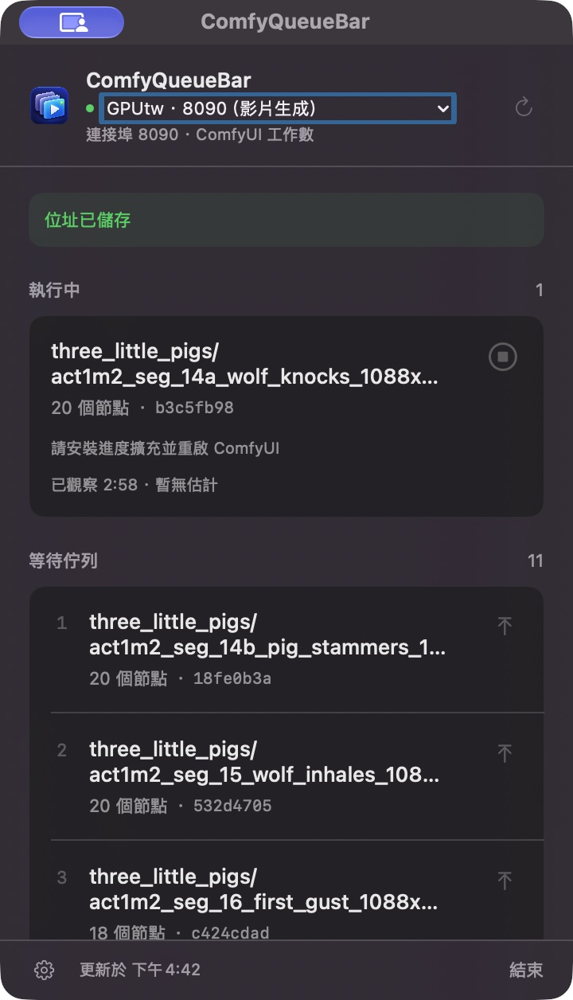
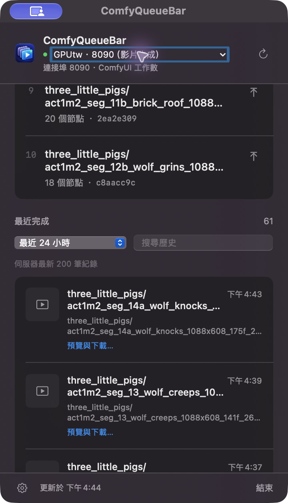

# 用 ComfyQueueBar 查看 GPUtw.ai 的影片佇列

一次把多支影片排進 ComfyUI 後，可以用 **ComfyQueueBar** 在 Mac 選單列查看還有多少工作正在執行、多少工作等待處理，不必一直切回 ComfyUI 網頁。

本篇帶你將 ComfyQueueBar 連到 **GPUtw.ai 上正在使用的 ComfyUI**。一次監控一個服務；工作數是「執行中＋等待中」，一個工作可能輸出一支或多支影片。

[回到專案首頁](README.zh-TW.md) · [完整遠端設定與疑難排解](REMOTE_SETUP.zh-TW.md)

## 先看實際畫面



這是 **2026-10-05 的真實工作畫面**：當時連到 `8090`，**1 個工作執行中、11 個等待中，合計 12 個尚未結束的工作**。數字會隨生成進度改變；11 個等待工作並非同時運算。

圖中的「請安裝進度擴充並重啟 ComfyUI」只影響節點百分比，**不影響佇列數量監控**。可以先使用佇列功能，等目前影片生成結束後再處理擴充。

## 1. 準備支援 GPUtw 的版本

**從 v1.5.3 起，下載版已包含 GPUtw 內建登入。** 若目前使用 v1.5.2，請在 App 的齒輪設定按 **檢查更新…**；也可從 [GitHub Releases](https://github.com/sakmor/ComfyQueueBar/releases/latest) 下載新版。下載版需要 macOS 13 以上與 Apple Silicon（M1 或更新）。

若使用 Intel Mac 或想自行編譯，還需要 Swift 5.9 以上的 Xcode／Command Line Tools。若尚未安裝編譯工具，先執行 `xcode-select --install`，完成後再執行：

```sh
git clone https://github.com/sakmor/ComfyQueueBar.git
cd ComfyQueueBar
bash build-app.sh
open build/ComfyQueueBar.app
```

若已開啟舊版 ComfyQueueBar，請先從舊版面板按 **結束**，再開啟剛編譯的版本，以免出現兩個選單列圖示。結束 ComfyQueueBar 不會停止遠端 ComfyUI 的生成工作。

詳細環境與安裝說明見[原始碼編譯教學](../../README.md#build-from-source)。

## 2. 在 App 內登入 GPUtw.ai

1. 確認 GPUtw 執行個體正在運行，且 ComfyUI 已啟動。
2. 點 macOS 選單列的 **ComfyQueueBar 圖示**，再點面板左下角的 **齒輪**。
3. 按 **登入 GPUtw…**。也可在 **ComfyUI 位址** 填入 `https://gputw.ai/dashboard`，再按 **連線**。
4. 在 App 開啟的瀏覽器完成 GPUtw 登入。Chrome 或 Safari 的登入狀態不會自動共用到 App。
5. 從 GPUtw 控制台開啟這次生成影片所用的 **ComfyUI Web UI**。若使用自訂 HTTP 連接埠，請開啟對應連接埠的 Web UI；有密碼保護時，在 GPUtw 頁面輸入既有密碼。

只停留在控制台或 Jupyter 頁面還不算選定 ComfyUI。必須先進入實際的 ComfyUI 服務，下一步的 **確認此 ComfyUI** 才能使用。

## 3. 核對連接埠，再開始監控

1. 在 App 內瀏覽器上方按 **確認此 ComfyUI**。
2. 在確認視窗核對 **連接埠、執行中／等待中數量，以及最近成功的工作**，確認和你提交影片的服務相符。
3. 按 **監控此伺服器**，App 才會儲存並選用這個服務。按 **取消** 會保留原本的監控連線。
4. 在齒輪設定中，可將 **伺服器名稱** 設成容易辨識的名稱，例如 `GPUtw · 8090（影片生成）`，再按 **儲存位址**。

**最容易選錯的是連接埠。** GPUtw 的 Web UI 網址形式為 `https://<連接埠>-<執行個體 ID>.gputw.ai`；同一個 GPU 執行個體可能有不同的 ComfyUI 服務。

| 你的生成頁面 | App 應核對的連接埠 |
| --- | --- |
| `https://8080-<執行個體 ID>.gputw.ai` | `8080` |
| `https://8090-<執行個體 ID>.gputw.ai` | `8090` |

`8080`、`8090` 是本篇的說明範例，**請以自己提交工作的頁面網址為準**。如果影片在 `8090` 排隊，連到另一個空的 `8080` 佇列，看到的數字就可能是 0。

GPUtw 的私人服務由控制台建立擁有者登入狀態；密碼保護的服務會先驗證密碼。這個連線流程不需要平台 API 金鑰，也不需要把服務改成公開。參考官方 [Web UI 說明](https://docs.gputw.ai/zh-TW/docs/jupyter-web-ui)與[連接埠存取模式](https://docs.gputw.ai/zh-TW/docs/ports)。

## 4. 看還剩多少工作，以及哪些已完成

- **選單列數字**：目前服務的執行中＋等待中工作總數。
- **執行中**：目前正在處理的工作。
- **等待佇列**：排隊中的工作與順序。
- **最近完成**：已成功的工作，可依時間篩選、搜尋，並點 **預覽與下載…** 查看輸出。

佇列每 **4 秒**更新；歷史每 **15 秒**更新，讀取伺服器最新最多 **200 筆**紀錄。



這張圖是同一場實際生成稍後的畫面。第一張中的工作已進入 **最近完成**，在所選「最近 24 小時」範圍內顯示 61 筆。歷史數字受時間篩選與伺服器紀錄上限影響，不是帳號全部影片的累計數。

## 常見狀況

| 畫面或問題 | 如何處理 |
| --- | --- |
| 找不到「登入 GPUtw…」 | 確認 App 已更新到 v1.5.3 或更新版本；v1.5.2 沒有這個按鈕。 |
| GPU 正在忙，App 卻顯示 `0` | 核對生成頁面與 App 的連接埠，並查看近期工作。GPU 使用率與佇列數是不同資料。 |
| 顯示 `!` 或要求登入 | 在 App 內重新登入，開啟正確 ComfyUI Web UI，再確認監控。 |
| 顯示 `—` | 連線失敗或佇列資料過期，工作數目前未知，不能當成已完成。 |
| 顯示 `…` | 正在等待首次佇列回應。 |
| 有工作數，沒有節點百分比 | 佇列監控已可使用。百分比需在那台遠端 ComfyUI 安裝進度擴充，並等工作結束後重啟。 |

App 一次監控一個服務，尚不會合併不同連接埠的佇列，也不顯示 GPU 使用率。若要切換，可點面板頂端的伺服器名稱，選擇已儲存的服務，再核對確認視窗。

遠端擴充、SSH 與登入恢復的完整步驟，請見[遠端設定教學](REMOTE_SETUP.zh-TW.md)。
