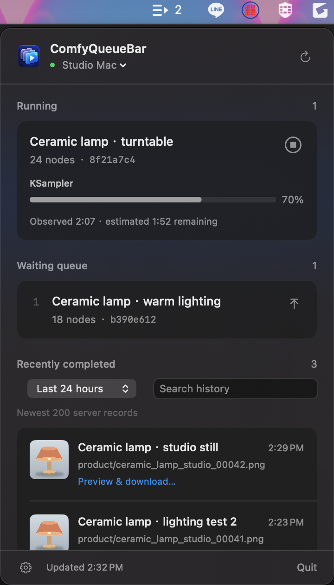
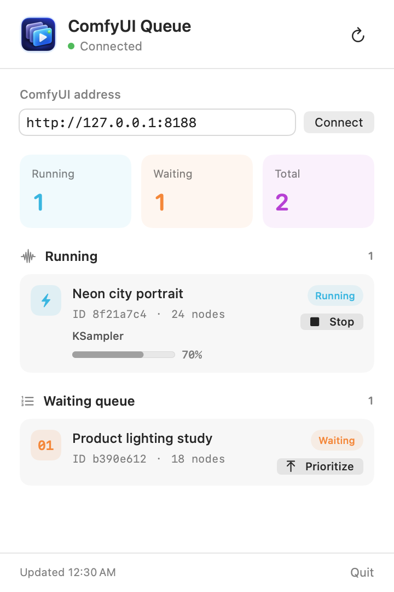
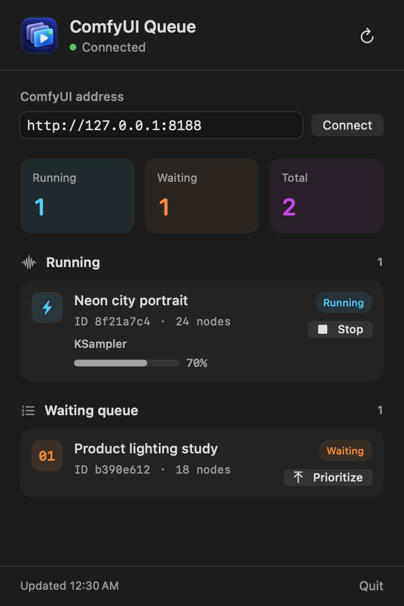

<p align="center"></p>

# ComfyQueueBar

**macOS のメニューバーから、ワンクリックで ComfyUI のキューを確認。** 実行中のジョブや現在のノードの進捗を確認し、次に実行するジョブを選べます。

[English](../../README.md) · [简体中文](README.zh-CN.md) · [繁體中文](README.zh-TW.md) · **日本語**

## 使い方を画像で見る

**macOS のメニューバーにあるアイコンをクリックすると、キューパネルが開きます。**



実際の macOS デスクトップを撮影した画像です。パネルはドキュメント用のデモモードで、固定のサンプルジョブを表示しています。実行中のワークフローや個人情報は含まれていません。画像内の英語の案内は「メニューバーのアイコンをクリック」という意味です。アプリは英語、簡体字中国語、繁体字中国語、日本語に対応し、macOS の優先言語に従って表示します。GitHub の画像は英語のままです。以下では画像と照合できるよう、ボタン名を英語で記載しています。システムまたはアプリの言語を変更したら、アプリを再起動してください。

<details>
<summary>ライトモードとダークモードの画面を見る</summary>




</details>

## 機能と動作要件

- SwiftUI 製のネイティブアプリ。Dock にウィンドウを表示せず、Electron やサードパーティ製 Swift パッケージを使用しません。
- 実行中と待機中のジョブの合計数をメニューバーに表示。各リストは **4 秒ごと**に更新します。
- ワークフロー名、短縮した prompt ID、ノード数、待機順を表示します。
- **Prioritize（優先実行）**：確認後、待機中のジョブをキューの先頭に移します。
- **Stop（停止）**：確認後、実行中のジョブの中断を要求し、待機キューは保持します。
- 任意のサーバー拡張機能を導入すると、現在のノード名と進捗率を **1 秒ごと**に更新します。
- サーバーアドレスの保存、手動更新、ローカル接続、SSH ポート転送に対応します。

| 項目 | 要件 |
| --- | --- |
| Mac | macOS 13 Ventura 以降 |
| ビルド | Swift 5.9 以降を含む適切な Xcode／Command Line Tools |
| ComfyUI | `/queue` と `/prompt` にアクセス可能であること。特定ジョブの停止には `/interrupt` が `prompt_id` に対応している必要があります |
| ノードの進捗 | `comfy_execution.progress.ProgressHandler`、`add_progress_handler`、`execution.reset_progress_state` を提供する ComfyUI |
| 拡張機能の環境 | ComfyUI 自身の Python 環境と既存の `aiohttp` を使用 |

アプリは macOS 専用です。リモートの ComfyUI は macOS、Linux、Windows で実行できます。ビルドで生成されるバイナリはビルドした Mac のアーキテクチャ用で、ユニバーサルバイナリではありません。古い ComfyUI や派生版では互換性が異なる場合があります。

## クイックスタート

### 1. ビルドツールを準備する

```sh
xcode-select --install
swift --version
```

インストール済みの場合はインストールを省略できます。Swift が 5.9 以降であることを確認してください。古い場合は Command Line Tools を更新するか、適切な Xcode を選択します。

### 2. ダウンロードしてビルドする

```sh
git clone https://github.com/sakmor/ComfyQueueBar.git
cd ComfyQueueBar
bash build-app.sh
open build/ComfyQueueBar.app
```

スクリプトはリリース用バイナリとアプリバンドルを作成し、ローカルの ad-hoc 署名を付けます。このリポジトリの `build/ComfyQueueBar.app` のみを再作成します。ComfyUI のインストールや起動は行いません。

### 3. ComfyUI に接続する

1. 既存の ComfyUI を起動します。
2. macOS メニューバーの ComfyQueueBar アイコンをクリックします。
3. **ComfyUI address** にアドレスを入力します。通常は `http://127.0.0.1:8188` です。
4. **Connect** をクリックします。
5. ComfyUI でジョブをキューに追加すると、次の更新時にパネルへ表示されます。

キューが空の場合も未接続の場合も 0 と表示されるため、パネルの接続状態を確認してください。次のコマンドでも確認できます。

```sh
curl --fail http://127.0.0.1:8188/queue
```

### 4. ノードの進捗を有効にする（任意）

キューの監視だけなら拡張機能は不要です。ノードの進捗を表示するには、**接続先のサーバーを実際に動かしている ComfyUI** に拡張機能をインストールします。

```sh
bash install-comfyui-extension.sh /path/to/ComfyUI
# 空白を含むパスは引用符で囲みます
bash install-comfyui-extension.sh "$HOME/AI Tools/ComfyUI"
```

生成が終わるのを待ってから ComfyUI を再起動し、次のコマンドで確認します。

```sh
curl --fail http://127.0.0.1:8188/comfyqueuebar/queue-progress
```

進捗がまだ報告されていない場合、レスポンスの null 値は正常です。アプリは prompt ID が実行中のジョブと一致する進捗だけを表示します。**パーセント表示は現在のノードの進捗で、ワークフロー全体の進捗ではありません。** ノードが変わると最初からになる場合があり、進捗率を報告しないノードもあります。リモート接続では拡張機能をサーバー側にインストールしてください。

## 通常のアプリとしてインストールする

```sh
mkdir -p "$HOME/Applications"
cp -R build/ComfyQueueBar.app "$HOME/Applications/"
open "$HOME/Applications/ComfyQueueBar.app"
```

置き換える前に既存のアプリを終了してください。ログイン時に起動するには、macOS の「システム設定 → 一般 → ログイン項目」でアプリを追加します。名称は macOS のバージョンによって異なる場合があります。アプリによる自動登録は行いません。

## キュー操作の仕組み

**Prioritize** は選択したワークフローを `front: true` で再送信してから元の待機項目を削除します。prompt ID は変わりますが、現在実行中のジョブは中断しません。複数のリクエストを使うため、途中で接続が切れたり元のジョブが実行を開始したりすると、競合や重複が起こる可能性があります。アプリは復旧を試み、結果を確認できない場合は ID を報告します。再試行する前にキューを確認してください。

**Stop** はキューを再確認してから、選択した実行中ジョブの prompt ID を `/interrupt` に送信します。待機ジョブは削除しません。対応サーバーでは指定したジョブが中断され、次の待機ジョブが開始される場合があります。古いサーバーでは ID が無視され、全体への中断が行われる場合があります。

再送信では `/queue` が返す prompt graph と `extra_data` を保持します。API が返さないサーバー固有のフィールドや送信オプションは保持できません。外部への副作用や有料 API ノードがあるワークフローでは、再送信の影響を確認してください。

## プライバシーとリモート接続

アプリは設定した ComfyUI アドレスにのみリクエストを送信します。アクセス解析、テレメトリー、クラウドアカウント、更新チェックはありません。アドレスは macOS の user defaults に保存されます。キューのレスポンスにはワークフローのメタデータが含まれる場合があります。

拡張機能は読み取り専用の JSON ルートを追加し、ComfyUI 内部の進捗 registry を利用します。reset 関数をラップしてジョブごとに監視を再登録します。WebSocket は開かず、キューの内容も変更しません。ルートの公開範囲はサーバーのネットワーク設定を引き継ぎ、**自動で localhost に限定されるわけではありません**。信頼できるネットワークや SSH ポート転送を利用してください。

アプリには独自の API key、bearer token、ログイン用の画面はありません。リクエスト URL の query と fragment は除外されるため、query-string に含めた認証情報は使用できません。

## 詳細ドキュメント（英語）

- [使い方と操作の詳細](../USAGE.md)
- [リモート接続、SSH、Windows の設定](../REMOTE_SETUP.md)
- [トラブルシューティング、更新、アンインストール](../TROUBLESHOOTING.md)
- [アーキテクチャ、API、テスト、互換性](../DEVELOPMENT.md)
- [セキュリティ](../../SECURITY.md)、[貢献ガイド](../../CONTRIBUTING.md)、[変更履歴](../../CHANGELOG.md)

## ライセンスと謝辞

[MIT ライセンス](../../LICENSE)で提供しています。[Clay Trouble](https://www.youtube.com/@ClayTrouble) の制作に使われていた AniClayFilm リポジトリの補助ツールから独立しました。この版は多言語対応の画面、独自のアプリ識別子と進捗エンドポイントを持ちます。映像素材、ワークフロー、モデル、認証情報は含まれていません。

[ComfyUI](https://github.com/Comfy-Org/ComfyUI) は別のプロジェクトです。ComfyQueueBar は独立したコミュニティ製ツールで、ComfyUI の公式製品ではありません。ComfyUI のソースコードも同梱していません。
