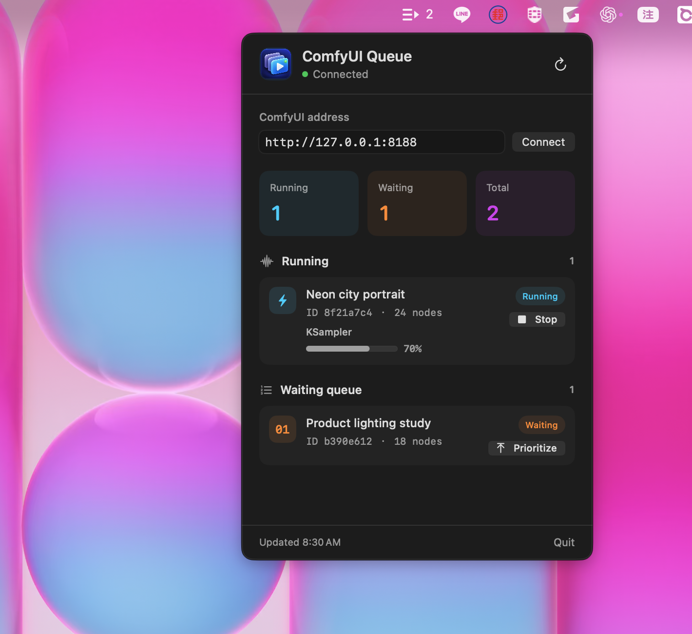
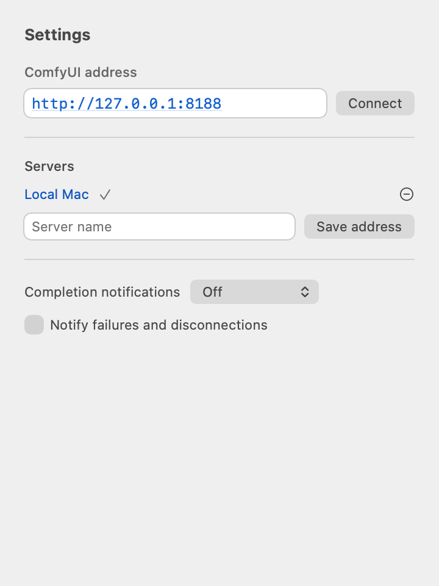

<p align="center"></p>

# ComfyQueueBar

**在 macOS 菜单栏，一键查看 ComfyUI 队列。** 查看正在运行的任务、当前节点进度，并决定下一个运行的任务。

**让 Agent 把 token 花在制作视频上，进度交给 ComfyQueueBar。**

长时间生成视频时，Agent 若反复查询“完成了吗”，每次模型回合和工具结果都可能消耗 token。ComfyQueueBar 让 Agent 订阅指定任务一次，由 App 和程序化等待接手监控，再在事件到达或你返回会话时处理结果，减少重复查询进度的 token 消耗。

[详细教程：安装、订阅、续查与 token 节省原理](AGENT_TOKEN_GUIDE.zh-CN.md)

App 自行监控不会调用语言模型；Agent 处理结果仍会使用 token。实际节省取决于原本查询频率、模型和视频耗时，目前未测量固定节省比例。标准 MCP 不会自动唤醒空闲会话。

[English](../../README.md) · **简体中文** · [繁體中文](README.zh-TW.md) · [日本語](README.ja.md)

最新版界面使用虚构示范任务与自制示例图片；桌面图为原生 macOS 截图。


## 看看它怎么用

**点击 macOS 菜单栏图标，即可展开队列面板。**



这是真实 macOS 桌面截图，面板使用文档演示模式与固定示例任务；不包含私人桌面内容或实时工作流。App 支持英文、简体中文、繁体中文与日文，根据 macOS 首选语言显示。GitHub 截图保持英文，下方按钮名称用英文对应说明。更改系统语言或 App 语言后，请重新启动 App。

<details>
<summary>查看浅色与深色界面</summary>


</details>

## 最近完成与新功能

- **唤醒 Mac**：在已保存地址中设置目标网卡 MAC、广播 IPv4 和 UDP 端口，可手动唤醒，或为当前选用的服务器启用离线时自动唤醒。完整步骤与限制见[远程设置教程](REMOTE_SETUP.zh-CN.md)。

每 **15 秒**读取最新 **200 条**服务器历史，可按最近一小时、24 小时、今天或已加载历史筛选，并搜索任务名称或输出文件名。没有时间戳的记录只出现在“已加载历史”。展开“失败与中断”可查看服务器错误原因；清除 ComfyUI 历史也会移除记录。

- **媒体预览与下载**：点击缩略图或 Preview & download…，选择输出后原生预览图片／视频，再通过 Download… 选择保存位置。MP4、MOV、M4V 需要 macOS 支持其编码，其他格式仍可下载。
- **通知**：齿轮设置可选关闭、每项完成或队列完成通知，并单独开启失败／断线提醒。默认关闭，开启需要 macOS 授权；首次连接不通知旧历史。
- **多服务器**：输入地址和名称，点击 Save address；点击面板顶部服务器名称可快速切换，一次监控一台。
- **时间估算**：显示 App 首次观察后的运行时间；至少三条设置相近且有起止时间的成功任务才估算剩余时间，负载与缓存可能影响准确度。



## GPUtw 与远程 Mac 教程

[English](../REMOTE_SETUP.md) · [简体中文](REMOTE_SETUP.zh-CN.md) · [繁體中文](REMOTE_SETUP.zh-TW.md) · [日本語](REMOTE_SETUP.ja.md)

学习 GPUtw 登录、辨认不同端口的服务、理解 `0`／`—`／`!`／`…`、切换前核对近期任务，以及 Wake-on-LAN 和 SSH 设置。

新功能已加入当前 `main` 源码，尚未包含在 v1.5.2 下载版中；新版发布前可按下方步骤自行编译。

## 功能与要求

- 原生 SwiftUI 工具，没有 Dock 窗口，不使用 Electron；自动更新使用开源 Sparkle 框架。
- 菜单栏显示运行中与等待中任务的总数；两份列表每 **4 秒**刷新。
- 显示工作流名称、简短 prompt ID、节点数与等待位置。
- **Prioritize（优先执行）**：确认后将等待中的任务移至队列前端。
- **Stop（停止）**：确认后请求中断正在运行的任务，保留等待队列。
- 安装可选的服务器扩展后，每 **1 秒**更新当前节点名称与百分比。
- 保存服务器地址，支持手动刷新、本地连接与 SSH 转发。

| 项目 | 要求 |
| --- | --- |
| Mac | macOS 13 Ventura 或更新版本 |
| 编译 | Swift 5.9 或更新版本，由适用的 Xcode／Command Line Tools 提供 |
| ComfyUI | 可访问 `/queue`、`/prompt`；停止指定任务需要 `/interrupt` 支持 `prompt_id` |
| 节点进度 | ComfyUI 提供 `comfy_execution.progress.ProgressHandler`、`add_progress_handler`、`execution.reset_progress_state` |
| 扩展环境 | 使用 ComfyUI 自身的 Python 环境与现有 `aiohttp` |

App 仅支持 macOS；远程 ComfyUI 可在 macOS、Linux 或 Windows 运行。构建生成当前 Mac 架构的程序，不是 universal binary。旧版或第三方 ComfyUI 的兼容性可能不同。

## 下载 Mac App

[ComfyQueueBar — Apple Silicon ZIP](https://github.com/sakmor/ComfyQueueBar/releases/latest/download/ComfyQueueBar-macOS-arm64.zip)

需要 macOS 13 或更新版本与 Apple Silicon（M1 或更新芯片）。下载 ZIP 后解压，将 `ComfyQueueBar.app` 移至“应用程序”并打开，无需安装 Swift 或 Xcode。Intel Mac 请使用下方源码构建步骤。

此版本使用 ad-hoc 签名，尚未经过 Apple 公证。如 macOS 阻止打开，先尝试打开，再到“系统设置 → 隐私与安全性”选择“仍要打开”并确认；仅对本仓库 Release 下载的文件操作。

## 自动更新

从 v1.2.0 起会自动检查（通常每 24 小时）、下载并在适当时机安装已签名的更新。面板提供“自动更新 App”开关与“检查更新”按钮。请将 App 放在可写入的应用程序文件夹；v1.1.0 或更旧版本需先手动下载新版一次。GitHub 截图保持英文，未展示新增的更新控件。

## 用 Skill 让 AI 查询任务

查看 [Agent 省 token 实操教程](AGENT_TOKEN_GUIDE.zh-CN.md)，包含可直接粘贴的指令、完整 prompt ID 获取、结果判断与故障排除。

1. 安装最新版 App 并连接 ComfyUI。
2. 打开 **设置 → AI Agent 集成 → 一键配置 Claude／Codex**，然后重新打开代理会话。升级 App 后再次执行设置，以更新已安装的 skill 和 MCP adapter；被替换的 skill 会备份。
3. 在 Codex 输入 `$comfyqueuebar 检查连接`；Claude Code 使用 `/comfyqueuebar 检查连接`。
4. 查询已有任务：`$comfyqueuebar 确认 prompt ID <prompt_id> 的结果`。保存返回的订阅 ID，之后输入 `$comfyqueuebar 继续查询订阅 <subscription_id>`。Claude Code 改用 `/comfyqueuebar` 前缀。

将占位文字替换为真实 ID。Skill 不会提交任务或更改队列，通常只等待一次、最长 45 秒；超时不代表任务失败或完成，仍可用订阅 ID 继续查询。标准 MCP 不会自动唤醒空闲会话，可启用 App 完成／失败通知后返回会话。详见[完整教程与故障排除（英文）](../AGENT_INTEGRATION.md#use-the-comfyqueuebar-skill)。

## 快速开始

### 1. 准备编译工具

```sh
xcode-select --install
swift --version
```

已安装工具可跳过安装。确认 Swift 至少为 5.9；版本过旧时更新 Command Line Tools，或选择适用的 Xcode。

### 2. 下载并构建

```sh
git clone https://github.com/sakmor/ComfyQueueBar.git
cd ComfyQueueBar
bash build-app.sh
open build/ComfyQueueBar.app
```

脚本编译 release 程序、创建 App bundle 并进行本地 ad-hoc 签名；只重新构建本仓库的 `build/ComfyQueueBar.app`，不会安装或启动 ComfyUI。

### 3. 连接

1. 启动现有的 ComfyUI。
2. 点击 macOS 菜单栏上的 ComfyQueueBar 图标。
3. 在齿轮设置的 **ComfyUI 地址** 输入地址，通常为 `http://127.0.0.1:8188`。
4. 点击 **连接**，核对端口和近期任务，再点击 **监控此服务器**。
5. 在 ComfyUI 提交任务，下一次刷新时应出现在面板中。

最新有效响应确认空队列时才显示 `0`；断开连接或数据过期显示 `—`，需要登录显示 `!`，首次检查连接显示 `…`。数字代表选用端口的 ComfyUI 任务数。也可直接检查：

```sh
curl --fail http://127.0.0.1:8188/queue
```

### 4. 启用节点进度（可选）

基本队列监控不需要扩展。要查看节点进度，请安装到**实际提供连接端点的 ComfyUI**：

```sh
bash install-comfyui-extension.sh /path/to/ComfyUI
# 路径包含空格时加上引号
bash install-comfyui-extension.sh "$HOME/AI Tools/ComfyUI"
```

等待生成结束后重启 ComfyUI，再检查：

```sh
curl --fail http://127.0.0.1:8188/comfyqueuebar/queue-progress
```

尚未报告进度时，响应中的 null 值是正常的。App 只显示 prompt ID 与运行中任务匹配的进度。**百分比是当前节点的进度，不是整个工作流的完成度**；切换节点时可能重新开始，部分节点不报告百分比。远程连接需要将扩展安装在服务器上。

## 安装与登录时启动

```sh
mkdir -p "$HOME/Applications"
cp -R build/ComfyQueueBar.app "$HOME/Applications/"
open "$HOME/Applications/ComfyQueueBar.app"
```

替换前先退出现有 App。需要登录时启动，可在 macOS“系统设置 → 通用 → 登录项”添加 App；名称可能随系统版本变化，App 不会自动注册。

## 操作的实际行为

**Prioritize** 使用 `front: true` 重新提交选中的工作流，再删除原来的等待项，因此 prompt ID 会改变，不会中断当前运行的任务。这是多次请求的操作；中途断线或原任务开始运行时，可能产生竞态或重复项。App 会尝试恢复，无法确认结果时报告 ID；重试前请先检查队列。

**Stop** 重新确认队列后，将选中的 prompt ID 发送到 `/interrupt`，不清除等待任务。兼容的服务器会中断指定任务，下一项可能接着开始。旧服务器可能忽略 ID，执行全局中断。

重新提交保留 `/queue` 返回的 prompt graph 与 `extra_data`，无法保留 API 未返回的私有字段或提交选项。含外部副作用或付费 API 节点的任务，重新提交前请确认影响。

## 隐私与远程连接

队列请求发送至设置的 ComfyUI 地址；更新检查与下载另外使用 GitHub。没有分析、遥测或云端账号，Sparkle 系统信息报告已关闭。地址与更新偏好保存在 macOS user defaults，队列响应可能包含工作流 metadata。

扩展添加只读 JSON 路由，通过 ComfyUI 内部进度 registry 观察进度，并包装 reset 函数以便逐任务重新注册；不开 WebSocket、不修改队列。路由沿用服务器的网络暴露范围，**不会自动限制为 localhost**。建议使用可信网络或 SSH port forwarding。

GPUtw 私有或密码保护的实例可使用“设置 → 登录 GPUtw…”，打开正确服务后点击“确认此 ComfyUI”，核对端口和近期任务，再点击“监控此服务器”。登录过期可重新登录；Cookie 由 App 的 WebKit 管理，受保护的输出也使用相同登录状态。完整步骤见 [GPUtw 与远程设置教程](REMOTE_SETUP.zh-CN.md)。

App 没有通用的自定义 API key 或 bearer token 界面。GPUtw 登录数据由 App 的 WebKit 管理，不写入服务器书签或 Agent 桥接文件；一般 API 请求仍不支持 query-string 凭据。

## 更多文档（部分为英文）

- [完整操作说明](../USAGE.md)
- [远程连接、SSH 与 Windows 设置](REMOTE_SETUP.zh-CN.md)
- [故障排查、更新与卸载](../TROUBLESHOOTING.md)
- [架构、API、测试与兼容性](../DEVELOPMENT.md)
- [安全说明](../../SECURITY.md)、[贡献指南](../../CONTRIBUTING.md)、[更新日志](../../CHANGELOG.md)

## 许可与致谢

采用 [MIT 许可](../../LICENSE)。源自 AniClayFilm 仓库中供 [Clay Trouble](https://www.youtube.com/@ClayTrouble) 使用的工具；独立版本具有多语言界面、独立 App identifier 与进度端点，不包含影片素材、工作流、模型或凭据。

[ComfyUI](https://github.com/Comfy-Org/ComfyUI) 是独立项目；ComfyQueueBar 是社区工具，并非官方产品，也未附带 ComfyUI 源代码。
